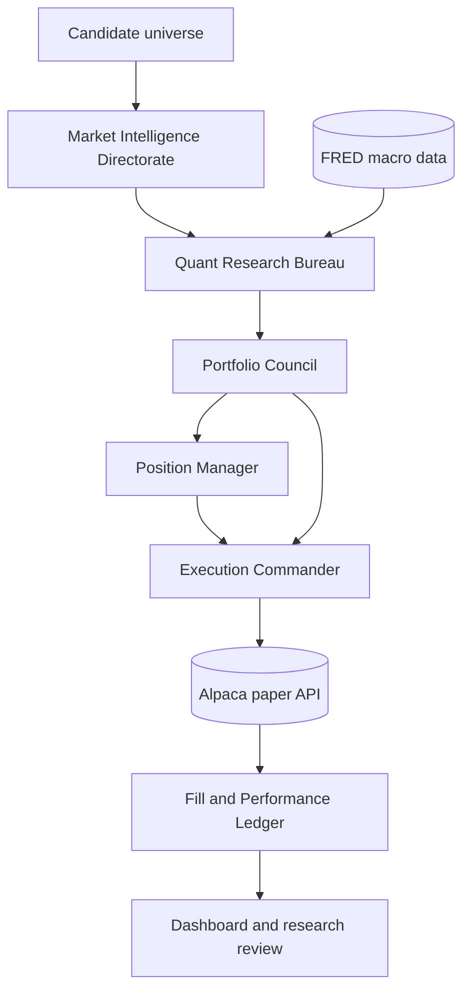

# Hierarchical 30-Minute Bulk Trading Research System

> A deterministic, paper-trading research platform for scanning a broad
> universe, combining statistical and machine-learning evidence, constructing
> a risk-constrained portfolio, and executing controlled Alpaca paper orders.

This repository is an experimental trading system. It does **not** claim a
profitable strategy, guaranteed returns, or suitability for live capital.
The purpose of the current implementation is to create a disciplined,
auditable experiment that can answer:

1. Which signals have predictive value out of sample?
2. Do those signals survive spread, slippage and turnover costs?
3. Does portfolio construction improve risk-adjusted performance?
4. Are orders, fills, exits and realized outcomes being recorded correctly?

The system is intentionally paper-only. The API key variable names are
unchanged and the broker endpoint is validated against the Alpaca paper host.

---

## Table of contents

- [Research objective](#research-objective)
- [System architecture](#system-architecture)
- [Hierarchy and responsibilities](#hierarchy-and-responsibilities)
- [30-minute cycle](#30-minute-cycle)
- [Market intelligence](#market-intelligence)
- [Quantitative research](#quantitative-research)
- [Signal fusion](#signal-fusion)
- [Portfolio construction](#portfolio-construction)
- [Position management](#position-management)
- [Execution and reconciliation](#execution-and-reconciliation)
- [Implemented formulas](#implemented-formulas)
- [Risk limits](#risk-limits)
- [Installation](#installation)
- [Configuration](#configuration)
- [Running locally](#running-locally)
- [GitHub Actions operation](#github-actions-operation)
- [Logging and dashboard](#logging-and-dashboard)
- [Project structure](#project-structure)
- [Research limitations](#research-limitations)
- [Recommended validation plan](#recommended-validation-plan)
- [Safety policy](#safety-policy)

---

## Research objective

The system is designed for repeated intraday portfolio experiments rather
than a single daily prediction. Every scheduled cycle:

- scans multiple symbols;
- uses both daily and 15-minute price data;
- evaluates technical, candle, macro, sentiment and ML evidence;
- evaluates current positions before new entries;
- ranks candidates as one portfolio rather than as isolated trades;
- applies exposure, volatility, correlation, cost and tail-risk controls;
- executes only a bounded paper batch;
- records broker responses and fill-status observations.

The central design principle is:

```text
Research can recommend.
Portfolio risk can approve or veto.
Execution can submit.
Monitoring can close and reconcile.
```

No model, sentiment source or lower-level research function is allowed to
submit an order.

---

## System architecture



The implementation is intentionally modular and deterministic. The word
"agent" describes a specialist responsibility; calculations are ordinary
Python functions so they can be tested, replayed and audited.

### Hierarchy

```text
Market Intelligence Directorate
  ├── Data validation
  ├── Technical and volatility analysis
  ├── Candlestick and price-action analysis
  └── News and social sentiment
          ↓
Quant Research Bureau
  ├── Statistical feature research
  ├── Triple-barrier labeling
  ├── Purged walk-forward ML
  ├── Probability calibration
  └── Macro and regime analysis
          ↓
Portfolio Council
  ├── Signal fusion
  ├── Cost and liquidity filter
  ├── Volatility-targeted sizing
  ├── Correlation filter
  └── Portfolio VaR/CVaR veto
          ↓
Execution Commander
  ├── Exit orders
  ├── New paper orders
  ├── Idempotency checks
  └── Fill-status reconciliation
```

---

## Hierarchy and responsibilities

### 1. Market Intelligence Directorate

File: `agents/market_intelligence.py`

This layer observes markets and does not size or trade.

#### Data validation

- Requires `Open`, `High`, `Low`, `Close` and `Volume`.
- Removes incomplete rows.
- Rejects non-positive close prices.
- Rejects invalid high/low relationships.
- Requires a minimum amount of historical data.
- Uses daily bars for longer-horizon features.
- Uses 15-minute bars for intraday confirmation.

#### Technical and statistical features

- 1-day, 5-day and 20-day returns.
- Annualized rolling volatility.
- RSI(14).
- ATR(14).
- EMA(12) and EMA(26).
- MACD histogram.
- Bollinger z-score.
- Volume ratio.
- 20-bar breakout and breakdown flags.

#### Candlestick and price-action features

The current implementation detects:

- Doji.
- Hammer.
- Shooting star.
- Bullish engulfing.
- Bearish engulfing.
- 20-bar breakout.
- 20-bar breakdown.

Candles are confirmation evidence. They do not override data quality,
portfolio limits, transaction costs or the final risk veto.

#### Sentiment

Reddit and RSS news are collected when available and scored with VADER.
Sentiment is optional evidence. A failed sentiment feed becomes an explicit
unavailable state rather than a hidden bullish or bearish signal.

---

### 2. Quant Research Bureau

File: `agents/quant_research.py`

This layer converts observations into research diagnostics and a directional
probability. It does not approve a portfolio or submit orders.

#### Triple-barrier labels

Instead of labeling every row only as "next close up" or "next close down",
the research model uses three barriers:

- Upper profit barrier: `+1.5 × rolling volatility`.
- Lower stop barrier: `-1.0 × rolling volatility`.
- Vertical time barrier: five future bars.

The first barrier touched determines the outcome. If neither horizontal
barrier is touched, the final return at the time barrier determines the
direction. The final five rows have unknown outcomes and are excluded from
training.

This makes the target more similar to an actual trade than a one-bar price
direction label.

#### Purged walk-forward validation

The model uses ordered validation blocks rather than random K-fold splitting.
For every validation block:

1. Training data comes only from the past.
2. The most recent five training bars are removed as an embargo.
3. The model predicts a future validation block.
4. The validation outcomes are stored for diagnostics.

This reduces leakage from overlapping five-bar labels. It is still not a
replacement for a complete strategy backtest.

#### Probability calibration

The Random Forest produces a raw probability. When enough out-of-sample
predictions are available, isotonic regression maps raw probabilities to
observed frequencies.

The record includes:

- `raw_probability`
- calibrated `probability`
- `oos_brier`
- `oos_samples`
- `calibrated`

The probability is not treated as trustworthy merely because a classifier
returned a number.

#### Macro and regime research

The current macro score uses:

- FRED `T10Y2Y`: 10-year minus 2-year Treasury spread.
- FRED `VIXCLS`: volatility index close.

The score is normalized to `[-1, 1]` where positive values represent a more
risk-on environment. Bull, bear and sideways regimes are derived from recent
trend relative to volatility.

The current macro snapshot is fused into the live score. It is not repeated
over historical training rows because doing so without point-in-time macro
history would contaminate model validation.

---

### 3. Portfolio Council

File: `agents/portfolio_council.py`

This is the portfolio-level decision layer. It receives all research results
before selecting any new trade.

It:

- removes flat signals;
- removes held symbols;
- removes symbols with open orders;
- disables shorts unless explicitly enabled;
- rejects signals whose estimated edge does not exceed estimated cost;
- ranks candidates by signal strength, volatility and cost;
- skips highly correlated candidates;
- applies volatility-targeted sizing;
- calculates historical portfolio VaR and CVaR;
- vetoes the entire new batch when tail-risk limits are breached.

The council does not blindly execute every approved symbol. It creates one
bounded portfolio plan.

---

### 4. Position Manager

File: `agents/position_manager.py`

Existing positions are evaluated before new entries.

For a long position:

```text
stop = entry_price − 2 × ATR(14)
```

For a short position:

```text
stop = entry_price + 2 × ATR(14)
```

An exit is requested when:

- the ATR stop is breached;
- the new signal is opposite to the position;
- the new signal becomes flat;
- no equivalent exit order is already open.

Exit logic is intentionally separate from entry logic. A system that only
opens positions cannot measure a complete strategy.

---

### 5. Execution Commander

File: `agents/execution_commander.py`

This is the only module allowed to submit Alpaca orders.

Before every batch it rechecks:

- paper endpoint;
- account buying power;
- existing positions;
- open orders;
- latest price;
- positive quantity;
- unique client order ID.

It handles both:

- approved position exits;
- approved new entries.

Order submission is not considered a fill. After submission, the broker order
is queried for status and fill details.

---

## 30-minute cycle

The full scheduled cycle is:

```text
1. Check workflow lock and market schedule.
2. Select and price-filter candidates.
3. Load daily and 15-minute bars.
4. Reject invalid or insufficient data.
5. Calculate technical, candle, volatility and sentiment evidence.
6. Calculate macro regime and quantitative research.
7. Produce triple-barrier ML probability.
8. Calibrate probability when enough OOS observations exist.
9. Evaluate existing positions and build exit plan.
10. Execute approved exits.
11. Rank new candidates as a portfolio.
12. Apply cost, volatility, correlation and VaR/CVaR controls.
13. Recheck prices, buying power and open orders.
14. Submit a bounded paper batch.
15. Query broker order status and fills.
16. Save account, positions, plans, failures and diagnostics.
```

The workflow is configured for approximately every 30 minutes during the
configured US market windows. GitHub Actions cron is UTC and daylight-saving
boundary behavior should be reviewed before relying on it for precise
execution timing.

---

## Signal fusion

The current combined research score is:

```text
score =
    0.40 × ML direction score
  + 0.20 × trend score
  + 0.15 × macro score
  + 0.10 × sentiment score
  + 0.05 × candle score
  + 0.10 × intraday score
```

Where:

```text
ML direction score = 2 × calibrated_probability − 1

trend score = tanh(3 × return_20d + 2 × return_5d)

intraday score = tanh(4 × intraday_return_5bars
                       + 2 × intraday_return_1bar)
```

The initial classification thresholds are:

```text
score >= +0.20  → long candidate
score <= −0.20  → short candidate
otherwise       → flat
```

These weights and thresholds are configuration hypotheses. They must be
tested with an out-of-sample experiment rather than assumed to be optimal.

---

## Implemented formulas

### Log return

```text
r_t = ln(C_t / C_(t−1))
```

Log returns are used for volatility and modeling because raw price levels are
usually non-stationary.

### Annualized volatility

```text
σ_annual = stdev(r_1 ... r_n) × sqrt(252)
```

This is a risk estimate, not a guaranteed forecast of future movement.

### RSI(14)

```text
RSI = 100 − 100 / (1 + average_gain / average_loss)
```

### Average True Range

```text
TR_t = max(
    High_t − Low_t,
    |High_t − Close_(t−1)|,
    |Low_t − Close_(t−1)|
)

ATR(14) = rolling_mean(TR, 14)
```

### Bollinger z-score

```text
z_t = (Close_t − SMA_20) / stdev_20
```

### Macro score

```text
yield_component = clip(T10Y2Y / 0.50, −1, 1)

vix_component = clip(1 − 2 × (VIX − 18) / 7, −1, 1)

macro_score = mean(available_components)
```

### Volatility-targeted allocation

```text
volatility_scale =
    min(1, target_annual_volatility / forecast_volatility)

position_notional =
    per_trade_cap × volatility_scale
```

The initial target annualized volatility is 12%. Higher-volatility symbols are
therefore allocated less notional.

### Transaction-cost gate

The current cost proxy is:

```text
estimated_cost =
    0.0015
  + 0.0005 × sqrt(volatility)
  + 0.0005 / sqrt(average_dollar_volume / 1,000,000)
```

An opportunity is rejected unless its estimated edge is larger than the
estimated round-trip cost. This is only a proxy until historical spread and
fill data are available.

### Correlation filter

Candidates with trailing return correlation greater than `0.85` to a selected
candidate are skipped. This avoids treating multiple highly correlated stocks
as independent bets.

### Portfolio VaR and CVaR

For portfolio weights `w_i` and historical returns `R_i,t`:

```text
R_portfolio,t = Σ(w_i × R_i,t)
```

Historical 95% VaR:

```text
VaR_95 = − percentile_5%(R_portfolio)
```

Historical 95% CVaR:

```text
CVaR_95 = − mean(R_portfolio | R_portfolio <= percentile_5%)
```

The initial council limits are:

```text
maximum portfolio VaR: 4%
maximum portfolio CVaR: 6%
```

---

## Risk limits

Default settings are deliberately conservative:

```text
Maximum candidates scanned per cycle: 100
Maximum new positions per cycle: 5
Maximum open positions: 15
Maximum single-position allocation: 3% of equity
Maximum new exposure per cycle: 10% of equity
Target annualized volatility: 12%
Maximum pairwise selection correlation: 0.85
Maximum portfolio VaR: 4%
Maximum portfolio CVaR: 6%
Short selling: disabled by default
```

These limits control operational risk. They do not prove that the underlying
signals have positive expected value.

---

## Installation

Windows PowerShell:

```powershell
python -m venv venv
venv\Scripts\Activate.ps1
pip install -r requirements.txt
python -m nltk.downloader vader_lexicon
```

If PowerShell execution policy blocks activation, use the environment's
Python executable directly or activate it from a permitted shell.

---

## Configuration

Copy the example file:

```powershell
Copy-Item config\.env.example config\.env
```

Keep the existing variable names:

```text
APCA_API_BASE_URL=https://paper-api.alpaca.markets
APCA_API_KEY_ID=...
APCA_API_SECRET_KEY=...

REDDIT_CLIENT_ID=...
REDDIT_CLIENT_SECRET=...
REDDIT_USER_AGENT=...

FRED_API_KEY=...
```

Do not commit `config/.env`. The code rejects a non-exact Alpaca paper
endpoint:

```text
https://paper-api.alpaca.markets
```

The repository does not contain or require hardcoded credentials.

---

## Running locally

### Dry analysis

```powershell
python main.py --symbols AAPL,MSFT,TSLA
```

This scans and creates a plan without submitting orders.

### Bounded paper batch

```powershell
python main.py `
  --max-candidates 100 `
  --max-new-positions 5 `
  --max-positions 15 `
  --max-position-pct 0.03 `
  --max-new-exposure-pct 0.10 `
  --target-annual-volatility 0.12 `
  --max-portfolio-var 0.04 `
  --max-portfolio-cvar 0.06 `
  --max-correlation 0.85 `
  --execute
```

### Enable shorts

Shorts are disabled by default. Do not enable them until borrow availability,
margin, buy-to-cover, borrow-fee and short-squeeze controls have been tested:

```powershell
python main.py --symbols AAPL,MSFT --allow-shorts --execute
```

### Main options

| Option | Default | Purpose |
|---|---:|---|
| `--symbols` | automatic universe | Explicit comma-separated symbols |
| `--max-candidates` | `100` | Universe scan cap |
| `--max-new-positions` | `5` | New entries per cycle |
| `--max-positions` | `15` | Total open-position cap |
| `--max-position-pct` | `0.03` | Per-position equity cap |
| `--max-new-exposure-pct` | `0.10` | New batch equity cap |
| `--target-annual-volatility` | `0.12` | Volatility-targeting level |
| `--max-portfolio-var` | `0.04` | Historical VaR veto |
| `--max-portfolio-cvar` | `0.06` | Historical CVaR veto |
| `--max-correlation` | `0.85` | Selection correlation limit |
| `--allow-shorts` | off | Permit short candidates |
| `--execute` | off | Submit paper orders |

---

## GitHub Actions operation

Workflow: `.github/workflows/trading-pipeline.yml`

The scheduled workflow:

- installs the pinned application requirements as declared;
- loads the same environment-variable names from GitHub Secrets;
- scans the candidate universe;
- runs the full research and portfolio process;
- submits only paper orders when execution is enabled;
- commits the updated history log.

The workflow has a concurrency group so overlapping cycles do not run
simultaneously. Review the cron windows, market holidays and daylight-saving
transitions before treating timestamps as exact.

For safer development, use a manual dry run first and inspect the generated
plan before using `--execute`.

---

## Logging and dashboard

### `logs/history.json`

Stores cycle-level records including:

- cycle timestamp and 30-minute interval;
- symbols scanned;
- research results;
- calibrated ML diagnostics;
- portfolio plan;
- exit plan;
- execution response;
- fill snapshots;
- account snapshots;
- positions before and after the cycle;
- failures;
- macro snapshot.

### `logs/trade_ledger.json`

Stores broker order-status observations:

- broker order ID;
- symbol and side;
- requested quantity;
- filled quantity;
- average fill price;
- status;
- submission timestamp;
- fill timestamp;
- reconciliation errors.

Submitted orders are not automatically treated as completed trades.

### `index.html`

The static dashboard reads `logs/history.json` and normalizes the new
portfolio-cycle format into per-symbol views for compatibility with earlier
records. It is an observability surface, not a source of trading decisions.

---

## Project structure

```text
.
├── agents/
│   ├── market_intelligence.py   # Data validation, technicals, candles, sentiment
│   ├── quant_research.py        # Labels, ML, calibration, macro and regimes
│   ├── portfolio_council.py     # Ranking, allocation, correlation, VaR/CVaR
│   ├── position_manager.py      # Stops, flat signals and reversal exits
│   └── execution_commander.py   # Only order-submission module
├── config/
│   └── .env.example              # Credential-name template
├── knowledge_base/
│   └── hierarchical_bulk_trading.md
├── logs/
│   ├── history.json
│   └── trade_ledger.json
├── scripts/
│   └── reconcile_history_log.py
├── tools/
│   ├── alpaca_tools.py           # Paper API and order-status functions
│   ├── fred_tools.py             # Macro observations
│   ├── reddit_news_scraper.py    # Reddit, RSS and Yahoo data
│   ├── run_logger.py             # Cycle history persistence
│   └── trade_ledger.py           # Fill snapshot persistence
├── main.py
├── requirements.txt
└── symbol_universe.py
```

---

## Research limitations

The current implementation is more disciplined than a simple indicator
strategy, but it still has important limitations:

- The Random Forest is not proof of predictive edge.
- Isotonic calibration can become stale in a new market regime.
- Current macro input is a live snapshot; point-in-time macro history should
  be used for serious backtesting.
- The transaction-cost model is a proxy, not historical bid/ask data.
- Yahoo data may not provide a survivorship-free universe.
- The manual candidate universe can contain stale membership.
- Historical portfolio VaR/CVaR can underestimate gaps and regime changes.
- Candlestick patterns are hypotheses that require statistical testing.
- Sentiment feeds can be incomplete, delayed, duplicated or noisy.
- Market orders can experience slippage and partial fills.
- GitHub Actions timing is not exchange-grade execution timing.
- The current ledger records observations, but a full realized-P&L accounting
  layer should aggregate round trips, fees, holding periods and attribution.
- No live trading should be enabled based only on paper results.

Advanced models such as HMMs, GARCH, XGBoost, reinforcement learning or
options overlays should not be added merely because they sound sophisticated.
They should be introduced only when a backtest demonstrates incremental
out-of-sample value after costs.

---

## Recommended validation plan

Before changing risk limits or considering live capital:

### 1. Build a point-in-time backtest

The backtest must use the same production path:

```text
historical data available at time t
→ research features
→ triple-barrier label/model
→ signal fusion
→ cost filter
→ portfolio selection
→ realistic order simulation
→ exits
→ realized result
```

### 2. Include realistic effects

- Bid/ask spread.
- Slippage.
- Partial fills.
- Market impact.
- Borrow cost for shorts.
- Commissions and fees.
- Corporate actions.
- Delisted symbols.
- Suspensions and missing data.
- Market holidays.
- Signal timestamp and execution delay.

### 3. Compare against baselines

- SPY buy-and-hold.
- Equal-weight universe.
- Simple momentum.
- Simple moving-average strategy.
- Random candidate selection.
- Current strategy with individual-symbol sizing.

### 4. Measure more than return

- Net return.
- Annualized return.
- Maximum drawdown.
- Sharpe and Sortino ratios.
- Calmar ratio.
- Hit rate.
- Average win and loss.
- Profit factor.
- Turnover.
- Capacity.
- Slippage.
- Exposure.
- Sector attribution.
- Regime attribution.
- Probability calibration and Brier score.

### 5. Run ablation tests

Test whether each family contributes incremental value:

```text
ML only
ML + technical trend
ML + trend + macro
ML + trend + macro + candles
ML + trend + macro + sentiment
full portfolio controls
```

Remove features that do not improve out-of-sample results after costs.

---

## Safety policy

The system is designed for paper trading and research only.

- Never place real orders with this repository without a separate security
  review and explicit redesign.
- Keep credentials in environment variables or secret storage.
- Do not commit `.env` files.
- Start with dry runs.
- Keep short selling disabled until separately validated.
- Treat every broker response as untrusted until reconciled.
- Keep position limits and the kill switch active.
- Do not interpret a few profitable paper trades as evidence of a durable edge.

The most valuable next improvement is not another indicator. It is a
survivorship-aware, point-in-time walk-forward backtest that measures the
complete portfolio lifecycle after realistic costs.
