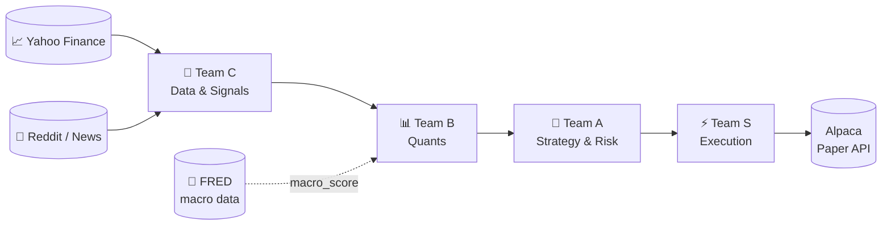

# 🧠 Hierarchical Multi-Agent Trading System

**Four teams. One chain of command. Zero live orders without risk sign-off.**

A CrewAI-orchestrated paper-trading pipeline that pulls real market, macro,
and sentiment data through a strict four-team hierarchy — Data → Quants →
Strategy/Risk → Execution — before a single order reaches Alpaca. Every
run is logged, every decision is explainable, and every trade is paper
money only.

<p>
  
  
  
  
</p>



Lower teams **structurally cannot** place trades — `execute_team_a_report()`
in `agents/team_s_execution.py` is the *only* function in this codebase
that calls Alpaca's `submit_order`, and it refuses to act unless Team A's
Risker set `approved: true`. That's a code-level guarantee, not a design
convention.

---

## 📚 Table of contents

- [What this actually is](#-what-this-actually-is)
- [Setup](#-setup)
- [Running it](#-running-it)
- [Architecture — what each team and agent does](#-architecture--what-each-team-and-agent-does)
  - [Team C — Data & Signals](#team-c--data--signals-4-agents)
  - [Team B — Quants](#team-b--quants-3-agents)
  - [Team A — Strategy & Risk](#team-a--strategy--risk-2-agents)
  - [Team S — Execution](#team-s--execution-1-agent)
- [Dashboard](#-dashboard)
- [Project structure](#-project-structure)
- [Safety rails](#-safety-rails)
- [Known limitations](#-known-limitations)

---

## 🔎 What this actually is

A ticker goes in one end and, four teams and roughly a dozen quantitative
and statistical models later, a sized, risk-checked paper trade (or a
clean `no_trade`) comes out the other end — automatically, every four
hours, for a whole price-filtered pool of candidates. Nothing here trades
real money: it runs exclusively against Alpaca's **paper** trading
endpoint, enforced in code (`get_alpaca_client()` raises if the base URL
isn't `paper-api.alpaca.markets`).

| | |
|---|---|
| **Orchestration** | CrewAI agents (`agents/`), driven by plain Python for deterministic, testable execution |
| **Market data** | Yahoo Finance (`yfinance`) — 2 years of daily OHLCV |
| **Macro data** | St. Louis Fed (FRED) — yield curve spread & VIX, both free |
| **Sentiment** | Reddit (PRAW) + RSS news, scored with VADER + TF-IDF |
| **ML** | `RandomForestClassifier`, walk-forward validated |
| **Execution** | Alpaca paper trading REST API, TWAP-sliced, buying-power checked |
| **Scheduling** | GitHub Actions, every 4 hours on weekdays — 100% free tier |
| **Dashboard** | Static GitHub Pages site reading the run log directly |

---

## ⚙️ Setup

```bash
python3 -m venv venv
source venv/bin/activate
pip install -r requirements.txt
python -m nltk.downloader vader_lexicon   # sentiment lexicon, one-time
```

```bash
cp config/.env.example config/.env
```

`config/.env` is git-ignored — every agent reads credentials via
`os.environ`, nothing is ever hardcoded.

| Variable | Needed for | Where to get it |
|---|---|---|
| `APCA_API_KEY_ID` | Alpaca paper trading | Alpaca dashboard → API keys |
| `APCA_API_SECRET_KEY` | Alpaca paper trading | Shown **once** at key generation — regenerate if lost |
| `APCA_API_BASE_URL` | Alpaca endpoint | Leave as `https://paper-api.alpaca.markets` |
| `REDDIT_CLIENT_ID` | Team C sentiment | reddit.com/prefs/apps → create a **script** app |
| `REDDIT_CLIENT_SECRET` | Team C sentiment | same app |
| `REDDIT_USER_AGENT` | Reddit API etiquette | any descriptive string |
| `FRED_API_KEY` | Team B macro regime | free at [fred.stlouisfed.org/docs/api/api_key.html](https://fred.stlouisfed.org/docs/api/api_key.html) |

News needs no key (public RSS feeds). If `FRED_API_KEY` is left unset, the
Economist falls back to a neutral `macro_score` of `0.0` rather than
failing the run — see [`tools/fred_tools.py`](tools/fred_tools.py).

Add the same secrets under **Settings → Secrets and variables → Actions**
to run on schedule.

---

## 🚀 Running it

**Locally:**

```bash
python main.py                                  # dry run, auto-selects affordable symbols
python main.py --symbols AAPL,MSFT,TSLA          # your own watchlist — skips price filtering
python main.py --execute                        # submit real paper trades
python main.py --max-position-usd 100 --execute  # raise the per-position ceiling
```

| Flag | Default | Meaning |
|---|---|---|
| `--symbols` | none | Comma-separated tickers. Omit to auto-select affordable symbols from the ~560-symbol candidate pool |
| `--max-position-usd` | `50` | Hard dollar ceiling for a single position |
| `--max-position-pct` | `0.25` | Ceiling as a fraction of current equity — smaller of the two wins |
| `--price-bracket-pct` | `0.125` | Per-share price ceiling as a fraction of equity, floor $1 |
| `--max-candidates` | `76` | Cap on affordable candidates that get the full pipeline per run |
| `--execute` | off | Without it, Team S is skipped entirely (dry run) |

**On GitHub Actions:** Actions tab → **Trading Pipeline** → **Run workflow**,
with the same inputs above available manually. Scheduled runs use the
defaults and **do execute trades**; a manual run is the only way to opt
into a dry run (`execute: false`).

**Schedule — every 30 minutes, during US market hours only, weekdays.**
GitHub cron is always UTC while US market hours shift with daylight
saving, so the two windows are scheduled separately:

| Period | US session | UTC window | IST window | Runs/day |
|---|---|---|---|---|
| Mar–Oct (EDT) | 9:30–16:00 ET | 13:30–20:00 | 7:00 PM – 1:30 AM | 14 |
| Nov–Feb (EST) | 9:30–16:00 ET | 14:30–21:00 | 8:00 PM – 2:30 AM | 14 |

US DST actually flips on the 2nd Sunday of March and the 1st Sunday of
November rather than on month boundaries, so for a few days each March
and November the window sits an hour off the real session. Orders are
`time_in_force: day`, so the failure mode is an order that queues for the
next open — not a rejected one. US market holidays aren't tracked either,
for the same reason.

<details>
<summary><b>How position sizing actually scales to a small account</b></summary>

<br>

```
price_ceiling  = max($1, equity × price_bracket_pct)
position_cap   = min(max_position_usd, equity × max_position_pct)
```

Both scale with live equity rather than a flat number disconnected from
the account. On a $200 account with the defaults, that's a **$1–$25**
per-share bracket and a **$50** position cap — further tightened by
Team A's half-Kelly (capped at 25% of that), landing the realistic
ceiling on any single trade near **$12.50**. Team S re-checks live
buying power immediately before every submission and clamps down to it,
since Team A sizes each symbol independently and several approved
theses in one batch can otherwise collectively overshoot what's left to
spend.

Long theses buy **fractional shares** (`qty = affordable_usd / price`,
unrounded) — Alpaca only restricts fractional orders on the *short*
side ("fractional orders cannot be sold short"), so this is what lets a
$12.50 thesis actually reach a $650 stock instead of skipping outright.
Short theses stay whole-share and skip cleanly if the ceiling can't
reach one.

</details>

<details>
<summary><b>What happens if two runs overlap</b></summary>

<br>

A manual trigger racing the scheduled cron (or two manual triggers close
together) can produce a rejected `git push` on whichever run's log commit
lands second. The workflow recovers on its own:
[`scripts/reconcile_history_log.py`](scripts/reconcile_history_log.py)
extracts just that run's own new records (by timestamp, against the
job's captured start time) and re-appends them onto the freshest
`origin/main` copy, retrying up to 5 times. No run's data is lost to the
race, and nothing needs manual intervention.

</details>

---

## 🏛️ Architecture — what each team and agent does

Data flows strictly downward — each team receives only the team above's
output packet, and no team below Team S can act on it.

### Team C — Data & Signals *(4 agents)*

`agents/team_c_data.py` · Input: a ticker → Output: prices, statistics,
forecasts, sentiment.

**Data Puller** pulls **2 years** of daily OHLCV from Yahoo Finance
(`yfinance`) and computes the daily **log-return** series that every
downstream statistical model is fit on:

$$r_t = \ln\left(\frac{S_t}{S_{t-1}}\right)$$

Log-returns are (approximately) stationary where raw price is not,
which matters directly for the Forecaster below.

**Statistician** turns prices into normalized signals:

| Signal | Definition | Reads as |
|---|---|---|
| SMA(20/50/200) | rolling mean of `Close` | trend direction across horizons |
| RSI(14) | $100 - \frac{100}{1+RS}$, $RS = \frac{\text{avg gain}}{\text{avg loss}}$ | overbought (>70) / oversold (<30) |
| Bollinger Bands(20, 2σ) | rolling mean ± 2 standard deviations | volatility envelope |
| Z-score(20) | $(P - \mu_{20})/\sigma_{20}$ | σ-distance from mean — mean-reversion signal |
| ATR(14) | rolling mean of true range | raw volatility, used for stop/size context |
| **MACD(12, 26, 9)** | $EMA_{12} - EMA_{26}$, signal = $EMA_9(MACD)$ | trend momentum & crossovers |
| **EMA-9 / EMA-21** | exponential moving averages | fast/slow trend crossover |

**Forecaster** projects 5 days ahead by fitting **on log-returns**, then
converting back to price space:

$$\hat{S}_{t+k} = S_t \cdot \exp\left(\sum_{i=1}^{k} \hat{r}_{t+i}\right)$$

- **ARIMA(1,0,1)** on the log-return series (no differencing term needed
  — the series is already stationary, unlike fitting directly on price).
- **Holt's exponential smoothing** (additive trend), same conversion.

**Sentiment Analyst** scrapes and scores text:
- **Reddit** (PRAW) — r/wallstreetbets, r/stocks, r/investing, last week, up to 50 posts each.
- **News** — Yahoo Finance + Google News RSS, no key required.
- **VADER** compound sentiment (−1 to +1), averaged across all text.
- **TF-IDF** for the top distinctive keywords.

### Team B — Quants *(3 agents)*

`agents/team_b_quants.py` · Input: Team C's packet → Output: regime,
probability, macro score.

**Mathematician** — stochastic calculus:

- **Geometric Brownian Motion.** Itô's Lemma applied to $\log S$ gives
  200 simulated forward price paths:

$$d(\log S) = \left(\mu - \tfrac{1}{2}\sigma^2\right)dt + \sigma\sqrt{dt}\,Z$$

- **Ornstein-Uhlenbeck fit.** OLS-regresses $X_t$ on $X_{t-1}$ to recover
  the discretized mean-reversion speed $\theta$, long-run mean $\mu$, and
  volatility $\sigma$ from $dX = \theta(\mu - X)dt + \sigma\,dW$. High
  $\theta$ = price snaps back to its mean quickly.
- **Regime detection** — bull / bear / sideways, from the 20-day mean
  return relative to 0.5× its standard deviation.
- **Macro-damped drift** — a concrete rule combining all three signals
  above with the Economist's `macro_score`:

  > If `macro_score < -0.3` **and** `theta < 1.0` (hostile macro *and*
  > weak mean-reversion — the series behaves like a persistent random
  > walk rather than snapping back), the GBM drift `μ` is halved before
  > it feeds the simulated paths. Strong reversion alone is treated as
  > enough to discount hostile macro; a random-walk-like series is not.

**ML Engineer** — probability of an up move:
- **Features**: 1-day return, 5-day return, 10-day rolling volatility,
  14-day RSI, 10-day momentum, and `macro_score` — the last one aligned
  **by date** to each historical training row (an as-of join against
  FRED's own daily history, forward-filled across non-trading days), not
  a single current snapshot repeated across every row.
- **Model**: `RandomForestClassifier` (200 trees, max depth 5).
- **Validation**: strict **walk-forward** over a rolling **252-day** (1
  trading year) window across the full 2-year history — trains only on
  data strictly *preceding* the prediction point. Ordinary K-fold CV
  leaks future data into the training set and makes financial models
  look far better than they are; this doesn't.
- **Output**: `probability_up_next_day` — the number Team A leans on hardest.

**Economist** — a real, quantitative macro regime score, not a
qualitative checklist. Pulled once per run (not once per symbol — macro
data doesn't vary by symbol) from [FRED](https://fred.stlouisfed.org/):

| Series | Bearish (−1) | Bullish (+1) | Between |
|---|---|---|---|
| `T10Y2Y` (10Y−2Y yield spread) | inverted, `< 0` | steepening, `> 0.5` | linear interpolation |
| `VIXCLS` (VIX close) | turbulent, `> 25` | calm, `< 18` | linear interpolation |

$$\text{macro\_score} = \text{clip}\left(0.5 \cdot \text{yield\_component} + 0.5 \cdot \text{vix\_component},\ -1,\ 1\right)$$

A missing reading (no key configured, or an API failure) contributes a
neutral `0` to its component rather than skewing the score or crashing
the run.

### Team A — Strategy & Risk *(2 agents)*

`agents/team_a_strategy.py` · Input: Team B's packet → Output: an
approved-or-vetoed, position-sized report.

**Trader** forms the directional thesis, gated by the macro regime:

| P(up) & regime | `macro_score` | Thesis |
|---|---|---|
| `> 0.55`, bull/sideways | `> 0` | **long**, full conviction |
| `> 0.55`, bull/sideways | `-0.3` to `0` | **long**, conviction halved |
| `> 0.55`, bull/sideways | `≤ -0.3` | **vetoed to `no_trade`** — macro outright hostile |
| `< 0.45`, bear/sideways | *(any)* | **short** — hostile macro doesn't gate a short thesis the same way |
| anything else | — | `no_trade` |

**Risker** sizes it, and holds veto power:
- **Half-Kelly**: $f^* = p - \frac{1-p}{b}$, halved for a safety margin,
  then capped at 25% of allocated capital. `b` (the win/loss ratio) is
  now **derived from the symbol's own 2-year realized return history**
  (average magnitude of up days ÷ average magnitude of down days)
  instead of a static assumption — the same quantity Kelly needs, priced
  off real historical outcomes rather than a guess, and cheap enough to
  compute once per symbol per run.
- **Historical VaR(95)** — empirical 5th-percentile loss.
- **CVaR(95)** — mean loss *beyond* VaR (the fat-tail measure).
- **GARCH(1,1)** forward-looking volatility:
  $\sigma_t^2 = \omega + \alpha\, r_{t-1}^2 + \beta\, \sigma_{t-1}^2$.
- **The veto** — VaR(95) above **5%** rejects the trade outright, size
  forced to `0`, and Team S never sees an actionable report.

### Team S — Execution *(1 agent)*

`agents/team_s_execution.py`, `tools/alpaca_tools.py` · Input: Team A's
report → Output: submitted paper orders.

- Refuses to act unless `approved: true`.
- Re-checks live buying power immediately before submitting and clamps
  down to it.
- **Long theses buy fractional shares** (unrounded `qty`) — skips
  cleanly below Alpaca's $1 fractional-order minimum.
- **Short theses stay whole-share** (Alpaca rejects fractional shorts) —
  skips cleanly if that rounds to zero.
- **TWAP-slices** whole-share (short) orders into 4 equal child orders.
  Fractional (long) orders submit as one — a $12 position has no market
  impact worth slicing against.
- Submits market orders, `time_in_force: day`, to the **paper** endpoint only.

---

## 📊 Dashboard

`index.html` — a static page reading `logs/history.json` same-origin,
self-refreshing every 60 seconds. Enable once: **Settings → Pages →
Deploy from a branch → `main` / `(root)`**, then visit
`https://<you>.github.io/<repo>/`.

| Tab | Shows |
|---|---|
| **Overview** | Equity curve, KPI tiles (incl. buying power and macro state), decision funnel, trade log, all-scans table |
| **Team C** | Close, RSI, SMA, MACD, EMA, Z-score, ATR, sentiment, keywords |
| **Team B** | Macro regime chart (`macro_score` over time, with 10Y−2Y / VIX tiles), regime, drift vs macro-adjusted drift, OU θ/μ, P(up) |
| **Team A** | Thesis, confidence, approved/vetoed + reason, Kelly, VaR/CVaR, size |
| **Team S** | Execution status, side, qty, reference price, skip reason |
| **Runs & logs** | One row per workflow execution (scanned/approved/orders/equity/buying power), plus a console-style transcript of the latest run with the pipeline's verbatim decision reasons |
| **How it works** | The four-stage pipeline with the live thresholds, the schedule, and the safety rails |

A published Claude Artifact can't serve this directly — its CSP blocks
fetching external JSON — which is why the dashboard lives in the repo
and is served by GitHub Pages instead.

---

## 🗂️ Project structure

```
agents/
├─ team_c_data.py          # Data Puller, Statistician, Forecaster, Sentiment Analyst
├─ team_b_quants.py         # Mathematician, ML Engineer, Economist (macro_score)
├─ team_a_strategy.py       # Trader (macro-gated), Risker (dynamic Kelly, VaR/CVaR)
└─ team_s_execution.py      # Execution agent — the ONLY caller of submit_order

tools/
├─ alpaca_tools.py          # Alpaca REST client, orders, TWAP slicing, batch pricing
├─ fred_tools.py            # FRED macro data — T10Y2Y, VIXCLS, with graceful fallback
├─ reddit_news_scraper.py   # Yahoo Finance, PRAW (Reddit), RSS news
└─ run_logger.py            # Appends each run's summary to logs/history.json

scripts/
└─ reconcile_history_log.py # Recovers from a git-push race on logs/history.json

config/.env.example         # Template for required environment variables
knowledge_base/*.md         # Per-team formulas + pointers to implementing code
logs/history.json           # Run history (written by the workflow, read by the dashboard)
index.html                  # Tabbed GitHub Pages dashboard
main.py                     # Entry point — macro fetch, candidate selection, pipeline loop
symbol_universe.py          # ~560-symbol candidate pool, price-filtered every run
.github/workflows/
└─ trading-pipeline.yml     # Every 4 hours, weekdays — free-tier GitHub Actions
```

---

## 🛡️ Safety rails

- **Paper only.** `get_alpaca_client()` raises unless the base URL
  contains `paper-api` — a live-trading URL can't be used by accident.
- **Risker veto.** VaR(95) above 5% blocks the trade; Team S cannot override it.
- **Double-margined sizing.** Half-Kelly, then capped at 25% of allocated capital.
- **Single execution chokepoint.** One function submits orders; every
  other agent is structurally incapable of trading.
- **Graceful macro degradation.** A missing `FRED_API_KEY` or a failed
  FRED call never raises — the Economist falls back to a neutral score.
- **No hardcoded keys.** All credentials come from `os.environ`, `.strip()`ed
  to survive stray whitespace pasted into CI secret fields.

---

## ⚠️ Known limitations

Worth being clear about, since this trades real (paper) money:

- **No profit guarantee.** No trading system can promise one, this
  included. The rails bound risk; they don't create edge.
- **The dynamic win/loss ratio is a realized-return proxy**, not a
  literal day-by-day backtest of the Trader's thesis rule — a true
  walk-forward re-simulation across 2 years of history, per symbol,
  would multiply this run's compute cost roughly 500×, which doesn't
  fit GitHub Actions' free-tier minutes across a ~76-symbol pool per run.
- **GARCH parameters are fixed** (ω, α, β hardcoded) rather than fit by
  MLE — the `arch` package would give a real fit.
- **Regime detection is a threshold rule**, not a true Hidden Markov Model.
- **No position/exit management.** The system opens positions; nothing
  closes them, sets a stop, or prevents stacking duplicate positions in
  the same symbol across runs.
- **Only ~76 symbols get the full pipeline per run** — a full
  ARIMA/GBM/Random-Forest pass doesn't scale to thousands of symbols in
  one run, and each additional symbol also means more Reddit API calls,
  which risks rate-limiting.
- **Short theses still can't reach higher-priced stocks** — longs buy
  fractional shares, but shorts stay whole-share only because Alpaca
  rejects fractional short sales.
